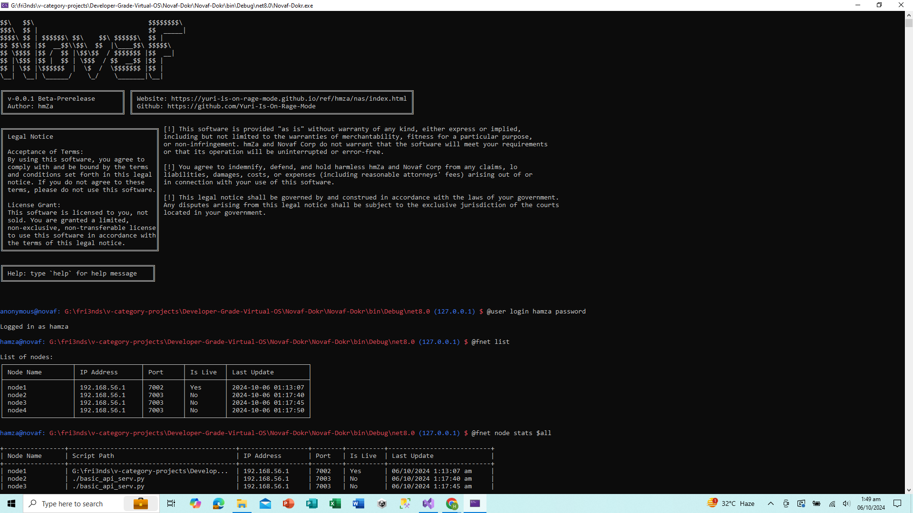
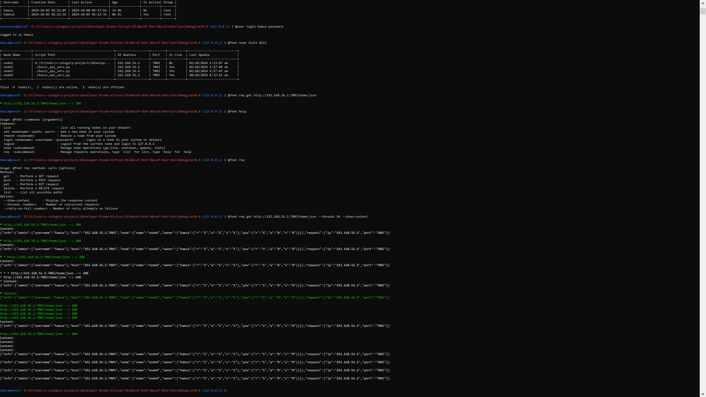

<br>
<br>

<h1 style="text-align:center;">NovaF-Dokr</h1>
<h3 style="text-align:center;">Is A New Type Of Network Interface</h3>

<p style="text-align:center;">
    A <strong>custom network interface</strong> designed with unique
    protocols and procedures,
    tailored specifically to serve its own set of applications. Built 
    upon the powerful foundation of the <strong>Vin Virtual OS</strong>,
    this interface brings
    flexibility and control to modern network operations.
</p>

</img>

<br>
<br>

</img>

## Version 1.1.0 (5/10/2024) Uploaded On (5~8/10/2024)

**Added some network and user commands:**

## **User Commands**

| Command                 | Description                                                                 | Imp |
|-------------------------|-----------------------------------------------------------------------------|-----|
| **@user**               | To manage users.                                                            |     |
| `@user list`            | To list all users.                                                          |  Y  |
| `@user add`             | To add a new user.                                                          |  Y  |
| `@user remove`          | To remove a user.                                                           |  Y  |
| `@user login`           | To login as a user.                                                         |  Y  |
| `@user logout`          | To logout from the current user and login as Guest.                         |  Y  |
| **More: (tier-2)**      |                                                                             |     |
| `@user name`            | To print the current username.                                              |  Y  | 
| `@user node-name`       | To print the current node name.                                             |  Y  |

### **Command Details**

1. **List Users**
   - **Command**: `@user list`
   - **Description**: Lists all the users currently in the system.
   - **Example**:
     ```bash
     @user list
     ```
   
2. **Add a User**
   - **Command**: `@user add <username> <password> <group>`
   - **Description**: Adds a new user with a username, password, and group.
   - **Example**:
     ```bash
     @user add john123 Passw0rd! guest
     ```
   - **Arguments**:
     - `<username>`: The username (3-20 characters)
     - `<password>`: The password (minimum 8 characters)
     - `<group>`: The user's group, e.g., `root`, `guest`, or `tmp`

3. **Remove a User**
   - **Command**: `@user remove <username>`
   - **Description**: Removes an existing user from the system.
   - **Example**:
     ```bash
     @user remove john123
     ```

4. **Login as a User**
   - **Command**: `@user login <username> <password>`
   - **Description**: Logs in with a specified username and password.
   - **Example**:
     ```bash
     @user login john123 Passw0rd!
     ```

5. **Logout**
   - **Command**: `@user logout`
   - **Description**: Logs out from the current user session and switches to Guest.
   - **Example**:
     ```bash
     @user logout
     ```

---

## **f-Net Commands**

| Command                 | Description                                                                 | Imp |
|-------------------------|-----------------------------------------------------------------------------|-----|
| **@fnet**               | To manage network nodes and systems.                                        |     |
| `@fnet list`            | To list all running nodes in your network.                                  |  Y  |
| `@fnet add`             | To add a new node in your system.                                           |  Y  |
| `@fnet remove`          | To remove a node from your system.                                          |  Y  |
| `@fnet login`           | To login to a node, either in your system or network.                      |  Y  |
| `@fnet logout`          | To logout from the current node and login to `127.0.0.1`.                   |  Y  |
| **More: (tier-2)**      |                                                                             |     |
| `@fnet node go-live`    | To publish a specific node or multiple nodes in your network.               |  Y  |
| `@fnet node shutdown`   | To shutdown a node in your network.                                         |  Y  |
| `@fnet node update`     | To update a node that you published or own.                                 |  Y  |
| `@fnet node stats`      | To view the stats of a specific node.                                       |  Y  |

### **Command Details**

1. **List Network Nodes**
   - **Command**: `@fnet list`
   - **Description**: Lists all running nodes in your network.
   - **Example**:
     ```bash
     @fnet list
     ```

2. **Add a Node**
   - **Command**: `@fnet add <nodename> <path> <port>`
   - **Description**: Adds a new node to your system with a name, path to its API script, and port.
   - **Example**:
     ```bash
     @fnet add node01 /api/script.py 5000
     ```
   - **Arguments**:
     - `<nodename>`: Name of the new node
     - `<path>`: Path to the Python Flask API script
     - `<port>`: Port number for the node

3. **Remove a Node**
   - **Command**: `@fnet remove <nodename>`
   - **Description**: Removes a node from your system.
   - **Example**:
     ```bash
     @fnet remove node01
     ```

4. **Login to a Node**
   - **Command**: `@fnet login <nodename> <username> <password>`
   - **Description**: Logs into a specific node in your system or network.
   - **Example**:
     ```bash
     @fnet login node01 admin Passw0rd!
     ```

5. **Logout from a Node**
   - **Command**: `@fnet logout`
   - **Description**: Logs out from the current node and switches to `127.0.0.1`.
   - **Example**:
     ```bash
     @fnet logout
     ```

6. **Publish a Node**
   - **Command**: `@fnet node go-live <nodename>`
   - **Description**: Publishes a specific node in your network.
   - **Example**:
     ```bash
     @fnet node go-live node01
     ```

7. **Shutdown a Node**
   - **Command**: `@fnet node shutdown <nodename>`
   - **Description**: Shuts down a specific node in your network.
   - **Example**:
     ```bash
     @fnet node shutdown node01
     ```

8. **Update a Node**
   - **Command**: `@fnet node update <nodename>`
   - **Description**: Updates a node you own or have published in your network.
   - **Example**:
     ```bash
     @fnet node update node01
     ```

9. **View Node Stats**
   - **Command**: `@fnet node stats <nodename>`
   - **Description**: Views the stats of a specific node.
   - **Example**:
     ```bash
     @fnet node stats node01
     ```

## **Request Commands (req)**

| Command                      | Description                                                                 | Imp |
|------------------------------|-----------------------------------------------------------------------------|-----|
| **@req**                     | To manage HTTP requests and interactions with URLs.                         |     |
| `@fnet req get`              | Perform a GET request to fetch data from the specified URL.                  |  Y  |
| `@fnet req post`             | Perform a POST request to send data to the specified URL.                    |  Y  |
| `@fnet req put`              | Perform a PUT request to update data at the specified URL.                   |  Y  |
| `@fnet req delete`           | Perform a DELETE request to remove resources at the specified URL.           |  Y  |
| `@fnet req list`             | List all possible paths available for requests.                             |  Y  |

### **Options**

- `--show-content` : Display the response content after the request is made.
- `--threads <number>` : Specify the number of concurrent requests to make.
- `--retry-on-fail <number>` : Set the number of retry attempts on failure.

### **Examples**

```bash
@fnet req get http://example.com
@fnet req post http://api.example.com/data --show-content
@fnet req get http://test.com --threads 5 --retry-on-fail 3
@fnet req put http://api.example.com/update --show-content
@fnet req delete http://api.example.com/resource/123
```


## Version 0.1.0 (5/10/2024) Uploaded On (5~8/10/2024)

**Added some network and user commands:**

## **User**

| Command                 | Description                                                                 | Imp |
|-------------------------|-----------------------------------------------------------------------------|-----|
| **@user**               | To manage users.                                                            |     |
| `@user list`            | To list all users.                                                          |  Y  |
| `@user add`             | To add a new user.                                                          |  Y  |
| `@user remove`          | To remove a user.                                                           |  Y  |
| `@user login`           | To login as a user.                                                         |  Y  |
| `@user logout`          | To logout from the current user and login as Guest.                         |  Y  |
| **More: (tier-2)**      |                                                                             |     |
| `@user name`            | To print the current username.                                              |  Y  | 
| `@user node-name`       | To print the current node name.                                             |  Y  |


## **f-Net**

| Command                 | Description                                                                 | Imp |
|-------------------------|-----------------------------------------------------------------------------|-----|
| **@fnet**               | To manage network nodes and systems.                                        |     |
| `@fnet list`            | To list all running nodes in your network.                                  |  Y  |
| `@fnet add`             | To add a new node in your system.                                           |  Y  |
| `@fnet remove`          | To remove a node from your system.                                          |  Y  |
| `@fnet login`           | To login to a node, weather in your system or within your network.          |  Y  |
| `@fnet logout`          | To logout from the current node and login to `127.0.0.1`.                   |  Y  |
| **More: (tier-2)**      |                                                                             |     |
| `@fnet node go-live`    | To publish a specfix node, or multipule nodes in your network.              |  Y  |
| `@fnet node shutdown`   | To takedown a node that you own in your network.                            |  Y  |
| `@fnet node update`     | To update a node that you published or a node that you own.                 |  Y  |
| `@fnet node stats`      | To view the stats of a specfix node.                                        |  n  |


<br>
<br>

# What is `f-Net`? 🌐🚀

> **f-Net** is a cutting-edge network protocol designed by developers, for developers. It's still under construction, but once it's live, it's going to shake things up and rock the internet!  Stay tuned for a revolution in network technology! 🌟

## **f-Net Protocols**
| Protocol                | Description                                                                 | Imp |
|-------------------------|-----------------------------------------------------------------------------|-----|
| `fri3ndly_network`      | A simple friendly testingground for fellow devs.                            |  n  |
| `Apin`                  | A simple Api-Friendly network built for apis.                               |  n  |
| `Bpin`                  | A simple For-Media-Storage network built for fast data transfers.           |  n  |


# **Note:** 📢

> ## `The f-Net will is implemented in version 1.0` 🚀


# **Community Contribution Needed!** 🤝

> ## `I need your support` and contributions to make this project even better! `Your ideas, feedback, and help are invaluable to us`. Together, we can create something amazing! 🌟

# **Contribution Guidelines:** 📜

> ## `There are no limits to what you can publish!` Feel free to contribute anything that you think will be helpful to the project. Whether it's a penetration testing module, network interface configurations, or any other network-related enhancements, all `contributions are welcome!` 🚀
